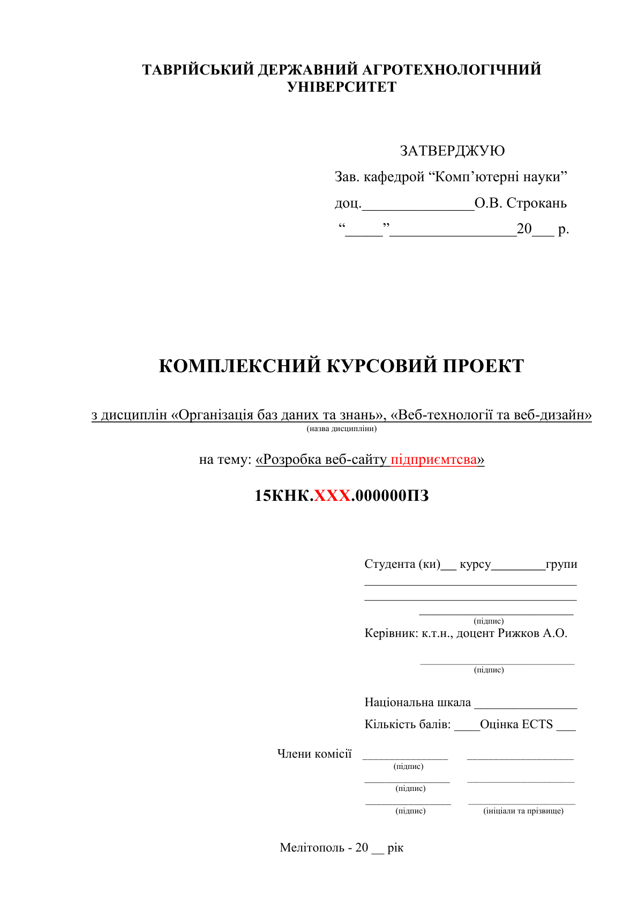

# Додатки

## Додаток А - Титульний лист проекту

Зразок титульного листа курсового проекту наведено в файлі [«*titul_kp.doc*»](files/titul_kp.doc), а для курсової роботи зразок титульного листа наведено в файлі [«*titul_kr.doc*»](files/titul_kr.doc). Вам треба вписати власну тему проекту/роботи взяту з файлу «Теми курсових проектів.pdf». Шифр на титульному листі має вигляд 15КНК.ХХХ.000000ПЗ, де ХХХ – тризначний номер вашої залікової книжки. Цей шифр також повторюється на кожному листі з рамкою. Сам шифр знаходиться в нижньому колонтитулі.
