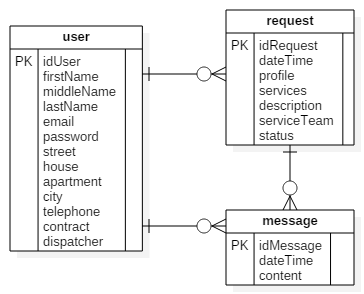
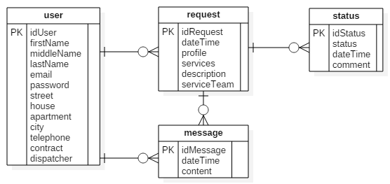

## Розділ "2 Розробка бази даних"

### Глава "2.1 Опис моделі даних"

Аналіз предметної області складається з аналізу даних та аналізу завдань. Аналіз даних передбачає документування всіх атрибутів. Аналіз завдань може потребувати застосування різноманітних методів побудови діаграм для дослідження зв'язків і способів використання даних, подій, станів даних, а також детального опису алгоритмів [1].

До ключового результату етапу аналізу належить узгоджена **діаграма сутностей і зв'язків**.

Мова **ER-моделювання** (від англ. Enticy-Relationship — сутність-зв'язок) — це графічна мова, призначена для опису інформаційних потреб організації. Мова базується на концепції, згідно з якою інформаційне забезпечення будь-якої предметної області зображується як сукупність взаємозв'язаних об'єктів. Процес моделювання полягає у виділенні об'єктів (сутностей предметної області), визначенні їхніх властивостей і виявленні зв'язків між ними [1, с. 157-171].

Вихідними даними для аналізу предметної області є модель варіантів використання, яка була розроблена в розділі 1. Задача розробника на даному етапі полягає в виявленні об'єктів даних та їх властивостей в описі варіантів використання веб-сайта. Такі об'єкти на діаграмі сутностей і зв'язків є **сутностями** — реальними або уявними об'єктами, інформація про які має бути зібрана чи збережена [1]. Відповідно, певні властивості об'єктів представляються **атрибутами**. Атрибут — це деталь або аспект якісного чи кількісного опису сутностей, їхньої ідентифікації, класифікації або відображення їхнього стану [1]. Також на діаграмі відображаються **зв'язки** — пойменовані асоціації двох або  більшої кількості сутностей [1].

Для всіх сутностей слід визначити **первинні ключі**. На діаграмі вони позначаються як `PK`. Первинні ключі є механізмом забезпечення цілісності відношень.

Діаграма сутностей і зв'язків, яка розробляться на даному етапі, має максимально відповідати сформованим вимогам до системи, дозволяти зберігати всю необхідну інформацію. В той же час ця діаграма може мати певні небажані властивості або аномалії. Їх усунення відбуватиметься в процесі нормалізації реляційних відношень в наступній главі шляхом еквівалентних перетворень первинної моделі реляційних відношень.

Пояснювальна записка має містити діаграму сутностей і зв'язків з необхідними поясненнями.

На перших етапах проектування бази даних діаграму сутностей і зв'язків можна створити за допомогою редактора діаграм UML [StarUML](http://staruml.io/), або іншого подібного. Приклад діаграми наведений на рис. 4.2.

*Рисунок 4.2 - Діаграма сутностей і зв'язків*

Найменування сутностям та атрибутам слід давати латинськими буквами - англійською мовою або в транслітерації українських літер. В останньому випадку, можна скористатись зручним [онлайн конвертором](http://translit.kh.ua/#lat/passport).

Сутності та атрибути іменуються в однині.

Також при написанні найменувань сутностей та атрибутів слід обрати один стиль написання та дотримуватись його впродовж всього проекту/роботи. Загально прийнятими є два **стилі написання складових слів**:

* **Верблюжий регістр** (від англ. *camelCase*) — стиль написання складових слів, у якому декілька слів пишуться разом без пробілів, при цьому кожне слово пишеться з великої літери. Приклади написання у верблюжому регістрі: `firstName`, `serviceTeam`.

* **Зміїний регістр** (від англ. *snake_case*) — стиль написання, у якому слова розділяються не пробілами, а символом підкреслення `_`, причому кожне слово пишеться з малої літери. Приклади написання у зміїному регістрі: `first_name`, `service_team`.

В даних методичних вказівках та прикладі проекту буде використовуватить верблюжий регістр.

Для повноти розуміння предметної області необхідно також привести **приклади данних в реляційних відношеннях**. Приклад наведено в табл. 4.2.

*Таблиця 4.2 - Реляційне відношення "request"*

idRequest | dateTime | user | profile | service | description | serviceTeam | status
----------|----------|------|---------|---------|------------|-------------|-------
145 | 2016-09-04 14:25 | Супрун І.О. | сантехніка | - Монтаж водопроводу - Заміна арматури - Чистка каналізації | Прочистити каналізацію | Панасенко, Мірошниченко | 2016-09-04 14:25 - 1 2016-09-04 16:40 - 3 2016-09-07 13:15 - 4
146 | 2016-09-04 15:05 | Коваленко П.С. | електрика | - Усунення аварійних відключень - Монтаж електропроводки | Немає електрики в квартирі | Пашко, Коваль | 2016-09-04 15:05 - 1 2016-09-04 17:25 - 2

*Додаткові матеріали до глави*:

- Пасічник В. В. Організація баз даних та знань / В. В. Пасічник, В. А. Резніченко. – К.: Видавнича група BHV, 2006. – 384 с. (с. 157-171).
- [Модель «сутність — зв'язок»](https://uk.wikipedia.org/wiki/%D0%9C%D0%BE%D0%B4%D0%B5%D0%BB%D1%8C_%C2%AB%D1%81%D1%83%D1%82%D0%BD%D1%96%D1%81%D1%82%D1%8C_%E2%80%94_%D0%B7%D0%B2%27%D1%8F%D0%B7%D0%BE%D0%BA%C2%BB)

### Глава "2.2 Нормалізація реляційних відношень"

Діаграма сутностей і зв'язків є, по суті, графічним представленням моделі реляційних відношень. Задачею даного етапу проекту/роботи є перетворення отриманої раніше первинної схеми на іншу схему, що еквівалентна в певному розумінні початковій і в якій відсутні певні небажані властивості, або аномалії.

Схема реляційних відношень (діаграма сутностей і зв'язків) побудована в п. 2.1 має пройти перевірку на відповідність шести **нормальним формам**:

* Перша нормальна форма (1НФ)
* Друга нормальна форма (2НФ)
* Третя нормальна форма (3НФ)
* Нормальна форма Бойса-Кодда (НФБК)
* Четверта нормальна форма (4НФ)
* П'ята нормальна форма (5НФ)

При виконанні цієї глави проекту/роботи слід для кожної нормальної форми послідовно:

* сформулювати та привести в тексті правило нормальної форми;
* перевірити всі реляційні відношення, отримані з моменту останнього еквівалентного перетворення схеми, на відповідність нормальній формі;
* в разі, якщо виявлено невідповідність поточної схеми відношень нормальній формі, слід виконати зведення (еквівалентне перетворення) відношень до необхідної нормальної форми; в тексті проекту пояснити виконані перетворення;
* привести діаграму сутностей і зв'язків з урахуванням виконаного перетворення (якщо воно виконувалось); ця схема буде вихідною для наступної нормальної форми.

Для прикладу розглянемо на відповідність першій нормальній формі моделі зображенійна рис. 4.2.

Реляційне відношення перебуває в першій нормальній формі (1НФ), якщо всі йоги атрибути мають атомарні (прості) домени, відтак значення елементів таблиці є простими [1].

Перевірка реляційних відношень показала, що у відношенні `request` наявна невідновідність вимогам 1НФ - атрибут `status` містить неатомарні значення. З таблиці 2.2 видно що за цим атрибутом перелічуються всі статуси відповідної заявки.

Для зведення реляційних відношень до 1НФ виділимо атрибут `status` в окреме відношення `status` і зв'яжимо його з відношенням `request`. Слід також вімітити, що аналіз прикладу даних атрибуту `status` (табл. 2.2) демонструє моєжливість виділити в новому відношенні додаткові атрибути - дата та час зміни статусу, коментар до зміни статусу. Результат зведення до 1НФ приведено на рис. 4.3.

*Рисунок 4.3 - Діаграма сутностей і зв'язків після приведення до 1НФ*

*Додаткові матеріали до глави*:

- [Нормалізація баз даних](https://uk.wikipedia.org/wiki/%D0%9D%D0%BE%D1%80%D0%BC%D0%B0%D0%BB%D1%96%D0%B7%D0%B0%D1%86%D1%96%D1%8F_%D0%B1%D0%B0%D0%B7_%D0%B4%D0%B0%D0%BD%D0%B8%D1%85)
- [Нормализация отношений. Шесть нормальных форм](https://habrahabr.ru/post/254773/)
- Пасічник В. В. Організація баз даних та знань / В. В. Пасічник, В. А. Резніченко. – К.: Видавнича група BHV, 2006. – 384 с. (с. 134-150).

### Глава "2.3 Визначення типів даних"

Для атрибутів рляційних відношень необхідно визначити:

* зазначення типів даних та їхніх розмірів (обов'язкова властивість);
* чи є обов'язковим значення атрибута;
* чи може значення атрибута дублюватися;
* можливі значення за замовчуванням.

Ці данні є важливим елементом забезпечення цілісності атрибутів рляційних відношень.

В проекті/роботі слід задокументувати типи даних за прикладом наведеним в табл. 4.3.

*Таблиця 4.3 - Типи даних реляційного відношення "user"*

Атрибут | Тип даних | Розмір | Додаткові обмеженні цілісності
--------|-----------|--------|------------------------------
idUser | INT | 10 | первинний ключ
firstName  | VARCHAR | 30 | обов'язковий
middleName  | VARCHAR | 30 | -
lastName | VARCHAR | 30 | обов'язковий
email | VARCHAR | 100 |обов'язковий, унікальний
password | VARCHAR | 255 | обов'язковий
street | VARCHAR | 25 | -
house | SMALLINT | 3 |-
apartment | SMALLINT | 3 |-
city | VARCHAR | 25 |-
telephone | INT | 10 |-
contract | DATE | - | -
dispatcher | TINYINT | 1 | за замовчуванням - 0

*Додаткові матеріали до глави*:

- [Справочник по MySQL : SQL : Типы данных, используемые в базе данных MySQL](http://www.spravkaweb.ru/mysql/sql/vartype)
- [Типы данных в MySQL (сжатый справочник для PHP программиста)](https://habrahabr.ru/post/36868/)
- [Справочное руководство по MySQL](http://www.mysql.ru/docs/man/Column_types.html)

### Глава "2.4 Обмеження цілісності даних"

*Додаткові матеріали до глави*:

### Глава "2.5 Індекси"

*Додаткові матеріали до глави*:

### Глава "2.6 Тригери"

*Додаткові матеріали до глави*:

### Глава "2.7 Реалізація SQL-скрипту"

*Додаткові матеріали до глави*:

 

[*Далі...*](ch04-04.md)
