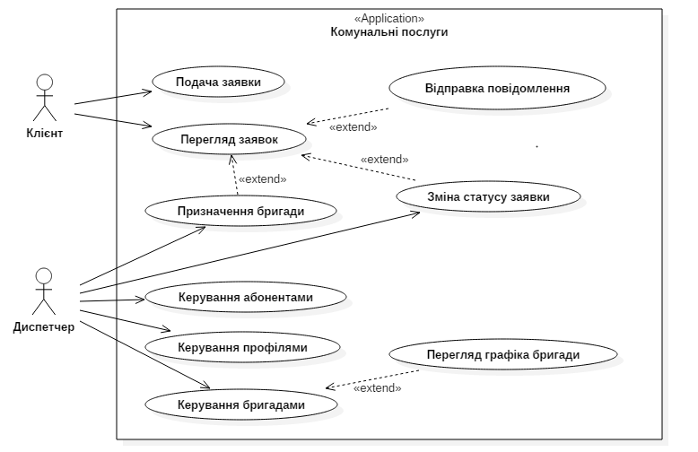

# 4 Вказівки до виконання розділів курсового проекту

При виконанні розділів, необхідно звернути увагу на:

## Титульний лист

Зразок титульного листа курсового проекту наведено в файлі [`titul_kp.doc`](files/titul_kp.doc) та в [додатку А](apend.md#Додаток-А---Титульний-лист-проекту). Для курсової роботи зразок титульного листа наведено в файлі [`titul_kr.doc`](files/titul_kr.doc). Вам треба вписати власну тему проекту/роботи взяту з файлу [`list.md`](list.md). Шифр на титульному листі має вигляд 15КНК.**ХХХ**.000000ПЗ, де **ХХХ** – тризначний номер вашої залікової книжки. Цей шифр також повторюється на кожному листі з рамкою. Сам шифр знаходиться в нижньому колонтитулі.

## Технічне завдання

Технічне завдання на проектування видається викладачем. В файлах [`task_kp.doc`](files/task_kp.doc) та [`task_kr.doc`](files/task_kr.doc), відповідно для курсового проекту і роботи, наведено шаблон. В ньому треба вставити власне прізвище, ім’я та по батькові, а також тему проекту/роботи. **Текст який підлягає корегуванню виділено червоним.**

## Реферат

Реферат виконується за прикладом в файлі «Сторінка з рамкою.docx». Має містити коротку анотацію того, що було виконано в роботі по розділах. Внизу вказуються ключові слова проекту/роботи, та інформація про кількість рисунків (Іл.), таблиць (Табл.) та книг зі списку літератури (Бібл.)

Обсяг розділу – 1 лист.

## Зміст

Зміст курсового проекту виконують відповідно до ГОСТ 2.105–95.

## Розділ "Вступ"

У вступі коротко надається інформація про актуальність розробки веб-сайту. Також формулюється мета роботи.

Приблизний обсяг розділу – 1 лист.

## Розділ "1 Аналіз вимог"

### Глава "1.1. Постановка завдання"

У відповідності до змісту роботи та виданого завдання ставляться мета та задачі розробки. Виконується у відповідності до [розділу 1](ch01.md) даних методичних вказівок.

В цій главі також слід вказати розміщення [Bitbucket репозиторію](https://bitbucket.org/) з програмним кодом та пояснювальною запискою проекту.

Приблизний обсяг розділу – 1 лист.

*Додаткові матеріали до глави*:
- [GitHub](https://github.com/)
- [Git](https://git-scm.com/book/uk/v2)

### Глава "1.2. Розробка моделі варіантів використання веб-сайту"

Для того, щоб більш точно зрозуміти як повинна працювати система, все частіше використовується опис функціональності системи через **варіанти використання** (Use Case або прецеденти). Варіанти використання це - опис послідовності дій, які може здійснювати система у відповідь на зовнішні впливи користувачів або інших програмних систем. Варіанти використання відображають функціональність системи з точки зору отримання відчутного результату для користувача, тому вони точніше дозволяють ранжувати функції за значимістю одержуваного результату.

Варіанти використання призначені в першу чергу для визначення функціональних вимог до системи і керують усім процесом розробки. Всі основні види діяльності такі як аналіз, проектування, тестування виконуються на основі варіантів використання. Під час аналізу і проектування варіанти використання дозволяють зрозуміти як результати, які хоче отримати користувач впливають на архітектуру системи і як повинні поводитися компоненти системи, для того щоб реалізувати потрібну для користувача функціональність.

Варіанти використання ілюструються за допомогою **діаграми варіантів використання**. Діаграма варіантів використання складається з акторів, для яких система виробляє дію і власне варіанти використання (Use Case), які описують те, що актор хоче отримати від системи. Актор позначається значком чоловічка, а варіанти використання - овалом. Додатково в діаграми можуть бути додані коментарі.

Відповіді на такі питання дозволять визначити акторів, що взаємодіють з системою:
- хто взаємодіє з системою або використовує систему;
- хто передає чи приймає інформацію в/з системи;
- хто є зовнішнім по відношенню до системи.

Кожен варіант використання показує, як конкретний актор використовує систему і надалі розширюється діаграмами станів і послідовності дій.



*Рисунок 4.1 - Діаграма варіантів використання*

Між акторами і варіантами використання можуть бути різні види взаємодії. Основні види взаємодії наступні:

- **Проста асоціація** - відображається лінією між актором і варіантом використання (без стрілки). Відображає зв'язок актора і варіанта використання.

- **Спрямована асоціація** - то ж що і проста асоціація, але показує, що варіант використання ініціалізуєтся актором. Позначається стрілкою.

- **Спадкування** - показує, що нащадок успадкує атрибути і поведінку свого прямого предку. Може застосовуватися як для акторів, так для варіантів використання.

- **Розширення** (extend) - показує, що варіант використання розширює базову послідовність дій і вставляє власну послідовність. При цьому на відміну від типу відносин "включення" розширена послідовність може здійснюватися в залежності від певних умов.

- **Включення** (include) - показує, що варіант використання включається в базову послідовність і виконується завжди (на рисунку не показаний).

Існують і інші види взаємодії, але вони, на мій погляд менш важливі і рідше застосовуються.

Для створення діаграми використання можна використовувати редактор діаграм UML [StarUML](http://staruml.io/), або інший.

В проекті також необхідно деталізувати кожний варіант використання, тобто виконати його уточнення за допомогою **специфікації варіанту використання**.

*Таблиця 4.1 - Специфікація варіанту використання*

| Варіант використання: Подача заявки |
|-------------------------------------|
| ID: 1 |
| Короткий опис:<br/> Клієнт подає заявку на виконання робіт з обслуговування будинку. |
| Головні актори:<br/> Клієнт |
| Другорядні актори:<br/> Немає|
| Передумови:<br/> 1 Клієнт зареєстрований в Системі |
| Основний потік:<br/> 1 Варіант використання починається коли Клієнт вводить команду створення нової заявки.<br/> 2 Клієнт вибирає тип послуги, яку йому треба виконати.<br/> 3 Клієнт описує детально роботу, яку необхідно виконати.<br/> 4 Система встановлює поточну дату та час подачі заявки.<br/> 5 Система присвоює заявці статус 1 - "Очікує розгляду". |
| Постумови:<br/> 1 Диспетчер отримує заявку клієнта на обробку. |
| Альтернативні потоки:<br/> Немає.|

Основний потік описує «ідеальний» хід розвитку подій у варіанті використання. Альтернативні потоки можуть перехоплювати помилки, відгалуження і переривання основного потоку.

Основний потік завжди починається з дій головного актора, спрямованих на ініціацію варіанту використання.

Вдалим способом початку потоку можна визначити таку форму запису:

```
Прецедент починається, коли <актор> <дія>.
```

Кожен етап потоку варіанту використання повинен бути виражений в такій формі:

```
<Номер> <хтось> <робить деяку дію>.
```

Використання пасивного стану для опису етапу є невірним: ~~«Вводяться дані покупця»~~.

Альтернативні потоки можуть бути замінені за допомогою ключового слова «Якщо».

*Основний потік:<br/>
1 Варіант використання починається коли Клієнт вибирає заявку зі списку.<br/>
2 Якщо Клієнт вибирає "видалити заявку".<br/>
&nbsp;&nbsp;&nbsp;&nbsp;2.1 Система призначає заявці статус "Відхилена".*

*Додаткові матеріали до глави*:
- [Діаграма прецедентів](https://uk.wikipedia.org/wiki/%D0%94%D1%96%D0%B0%D0%B3%D1%80%D0%B0%D0%BC%D0%B0_%D0%BF%D1%80%D0%B5%D1%86%D0%B5%D0%B4%D0%B5%D0%BD%D1%82%D1%96%D0%B2)
- [Сценарій використання](https://uk.wikipedia.org/wiki/%D0%A1%D1%86%D0%B5%D0%BD%D0%B0%D1%80%D1%96%D0%B9_%D0%B2%D0%B8%D0%BA%D0%BE%D1%80%D0%B8%D1%81%D1%82%D0%B0%D0%BD%D0%BD%D1%8F)
- [Моделирование прецедентов](http://glebradchenko.susu.ru/courses/bachelor/engineering/2011/SE_04_Use_case.pdf)

## Розділ "2 Розробка бази даних"
### Глава "2.1 Опис моделі даних"
### Глава "2.2 Нормалізація відношень"
### Глава "2.3 Визначення типів даних"
### Глава "2.4 Обмеження цілісності даних"
### Глава "2.5 Індекси"
### Глава "2.6 Тригери"
### Глава "2.7 Реалізація SQL-скрипту"
## Розділ "3 Розробка веб-додатку"
### Глава "3.1 Структура веб-сайту"
### Глава "3.2 Макети сторінок веб-сайту"
### Глава "3.3 Програмування серверної частини"
### Глава "3.4 Програмування клієнтської частини"
### Глава "3.5 Автентифікація користувачів"
### Глава "3.6 Розміщення веб-сайту в Інтернеті"
## Розділ "Висновки"
## Розділ "Список літератури"
## Розділ "Додатки"

Додаток А. HTML і CSS

Додаток Б. JavaScript на боці сервера

Додаток В. JavaScript в браузері
