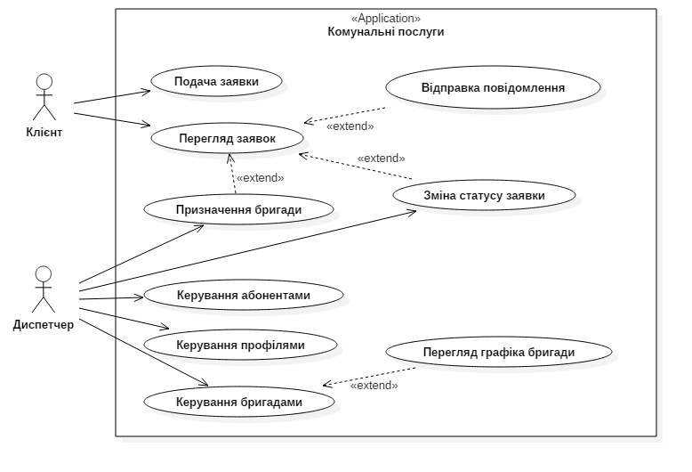

# 1 Аналіз вимог

## 1.1 Постановка завдання

**Метою** курсового проекту є створення веб-сайту обслуговуючої комунальної компанії, за допомогою якого клієнти зможуть робити заявки на обслуговування будинку он-лайн, переглядати стан заявок та спілкуватись з диспетчером компанії за допомогою повідомлень.

Сайт повинен відповідати наступним **вимогам**:

1. Зовнішнє оформлення повинно бути виконано в класичному стилі;
2. Дизайн сайту не повинен повторювати сайти конкуруючих фірм;
3. Сайт повинен давати повну і правильну інформацію про послуги та стан виконання заявок з обслуговування будинку;
4. Адміністративний інтерфейс сайту має бути інтуїтивним та зрозумілим користувачу початкового рівня.

Для виконання поставленої мети необхідно врішити наступні **задачі**:

1. Проаналізувати вимоги до Інтернет сайту;
2. Розробити базу даних Інтернет сайту;
3. Розробити інтерфейс користувача сайту;
4. Розробити програмне забезпечення сайту на стороні сервера;
5. Розмістити сайт в мережі Інтернет.

## 1.2 Розробка моделі варіантів використання веб-сайту

Для опису функціональних вимог до веб-сайту скористаємось описом варіантів використання системи. Варіант використання у розробці програмного забезпечення це опис поведінки системи, як вона відповідає на зовнішні запити. Іншими словами, різновид використання описує, «хто» і «що» може зробити з розглянутою системою. Методика різновидів використання застосовується для виявлення вимог до поведінки системи, відомих також як функціональні вимоги.

Графічно варіанти використання представляються за допомогою UML діаграми варіантів використання, на якій зображено відношення між акторами та варіантами використання в системі.

*Рисунок 1.1 - Діаграма варіантів використання веб- сайту*

Для деталізації варіантів використання складемо їх специфікації (табл. 1.1-1.9).

*Таблиця 1.1 - Специфікація варіанту використання*

| Варіант використання: Подача заявки |
|-------------------------------------|
| ID: 1 |
| Короткий опис:  Клієнт подає заявку на виконання робіт з обслуговування будинку. |
| Головні актори:  Клієнт |
| Другорядні актори:  Немає|
| Передумови:  1 Клієнт зареєстрований в Системі |
| Основний потік:  1 Варіант використання починається коли Клієнт вводить команду створення нової заявки.  2 Клієнт вибирає тип послуги, яку йому треба виконати.  3 Клієнт описує детально роботу, яку необхідно виконати.  4 Система встановлює поточну дату та час подачі заявки.  5 Система присвоює заявці статус 1 - "Очікує розгляду". |
| Постумови:  1 Диспетчер отримує заявку клієнта на обробку. |
| Альтернативні потоки:  Немає.|
