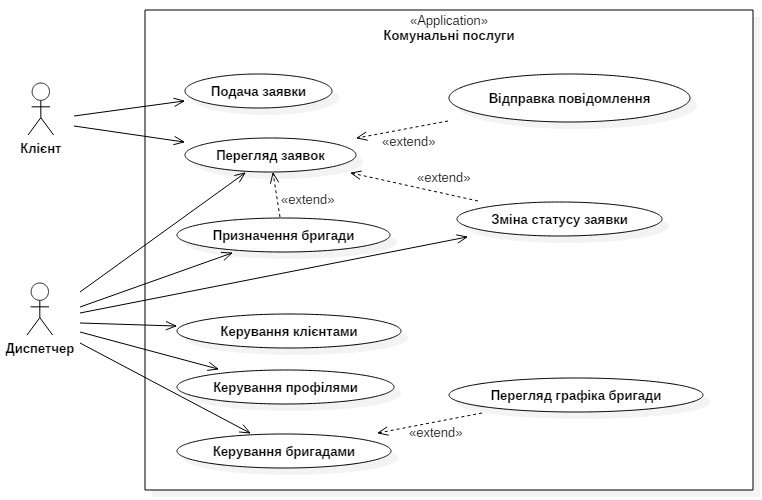

# 1 Аналіз вимог

## 1.1 Постановка завдання

**Метою** курсового проекту є створення веб-сайту обслуговуючої комунальної компанії, за допомогою якого клієнти зможуть робити заявки на обслуговування будинку он-лайн, переглядати стан заявок та спілкуватись з диспетчером компанії за допомогою повідомлень.

Сайт повинен відповідати наступним **вимогам**:

1. Зовнішнє оформлення повинно бути виконано в класичному стилі;
2. Дизайн сайту не повинен повторювати сайти конкуруючих фірм;
3. Сайт повинен давати повну і правильну інформацію про послуги та стан виконання заявок з обслуговування будинку;
4. Адміністративний інтерфейс сайту має бути інтуїтивним та зрозумілим користувачу початкового рівня.

Для виконання поставленої мети необхідно вирішити наступні **задачі**:

1. Проаналізувати вимоги до Інтернет сайту;
2. Розробити базу даних Інтернет сайту;
3. Розробити інтерфейс користувача сайту;
4. Розробити програмне забезпечення сайту на стороні сервера;
5. Розмістити сайт в мережі Інтернет.

## 1.2 Розробка моделі варіантів використання веб-сайту

Для опису функціональних вимог до веб-сайту скористаємось описом варіантів використання системи. Варіант використання у розробці програмного забезпечення це опис поведінки системи, як вона відповідає на зовнішні запити. Іншими словами, різновид використання описує, «хто» і «що» може зробити з розглянутою системою. Методика різновидів використання застосовується для виявлення вимог до поведінки системи, відомих також як функціональні вимоги.

Графічно варіанти використання представимо за допомогою UML діаграми варіантів використання, на якій зобразимо відношення між акторами та варіантами використання в системі.

 

*Рисунок 1.1 - Діаграма варіантів використання веб-сайту*

 

В моделі використання виявлені два актори:

**Клієнт** - це зареєстрований користувач веб-сайту, який може робити заявки на обслуговування будинку он-лайн, переглядати стан заявок та спілкуватись з диспетчером компанії за допомогою повідомлень.

**Диспетчер** - це зареєстрований користувач веб-сайту, який є співробітником обслуговуючої компанії; він виконує управління потоком виконання заявок на обслуговування від Клієнтів, спілкується з Клієнтами за допомогою повідомлень.

Уточнимо деякі терміни, які з'явились на діаграмі використання:

**Заявка** - звернення Клієнта до компанії з вимогою проведенні певних видів робіт з обслуговування будинку. Протягом свого життєвого циклу заявки можуть мати 4 наступні статуси:

1. Очікує розгляду
2. Відхилена
3. Призначено бригаду
4. Виконана

**Бригада** - група співробітників компанії, яка виконує певні види робіт з обслуговування за одним профілем.

**Профіль** (профіль обслуговування) - характер робіт, які може виконувати певна бригада. Наприклад, можуть бути профілі "електрика", "сантехніка" та інші. В описі профілю вказується детальна інформація про доступні види робіт, які будуть пропонуватись клієнтам компанії.

Для деталізації варіантів використання складемо їх специфікації (табл. 1.1-1.9).

 

*Таблиця 1.1 - Специфікація варіанту використання "Подача заявки"*

| Варіант використання: Подача заявки |
|-------|
| ID: 1 |
| Короткий опис:  Клієнт подає заявку на виконання робіт з обслуговування будинку. |
| Головні актори:  Клієнт |
| Другорядні актори:  Немає|
| Передумови:  1 Клієнт зареєстрований в Системі. |
| Основний потік:  1 Варіант використання починається коли Клієнт вибирає команду створення нової заявки.  2 Клієнт вибирає тип послуги, яку йому треба виконати.  3 Клієнт описує детально роботу, яку необхідно виконати.  4 Система встановлює поточну дату та час подачі заявки.  5 Система присвоює заявці статус 1 - "Очікує розгляду". |
| Постумови:  1 Диспетчер отримує заявку клієнта на обробку. |
| Альтернативні потоки:  Немає.|

 

*Таблиця 1.2 - Специфікація варіанту використання "Перегляд заявок"*

| Варіант використання: Перегляд заявок |
|-------|
| ID: 2 |
| Короткий опис:  Клієнт або Диспетчер переглядає список поданих заявок на обслуговування. |
| Головні актори:  Клієнт, Диспетчер |
| Другорядні актори:  Немає|
| Передумови:  1 В Системі наявні заявки на обслуговування від Клієнтів. |
| Основний потік:  1 Варіант використання починається коли Клієнт/Диспетчер вибирає команду перегляду наявних заявок.  2 Система виводить список заявок  Клієнт вибирає тип послуги, яку йому треба виконати.  &nbsp;&nbsp;&nbsp;2.1 Якщо актором є Клієнт, то Система виводить лише заявки авторизованого Клієнта.   3 Клієнт/Диспетчер вибирає заявку зі списку.  4 Система виводить номер заявки.  5 Система виводить дату подачі заявки.  6 Система виводить поточний статус заявки.  7 Система виводить історію зміни статусу заявки.  8 Система виводить клієнта, який подав заявку (лише якщо перегляд виконує Диспетчер).  9 Система виводить профіль обслуговування.  10 Система виводить опис поданої заявки.  11 Система виводить відомості про призначену на обслуговування бригаду.  12 Система виводить повідомлення, які були надіслані щодо поточної заявки.|
| Постумови:  1 Клієнт/Диспетчер отримують інформацію щодо поданих заявок. |
| Альтернативні потоки:  Немає.|

 

*Таблиця 1.3 - Специфікація варіанту використання "Відправлення повідомлення"*

| Варіант використання: Відправлення повідомлення |
|-------|
| ID: 3 |
| Короткий опис:  Клієнт або диспетчер відправляє повідомлення щодо поточної заявки. |
| Головні актори:  Клієнт, Диспетчер |
| Другорядні актори:  Немає|
| Передумови:  1 Клієнт/Диспетчер переглядає подану заявку на обслуговування. |
| Основний потік:  1 Варіант використання починається коли Клієнт/Диспетчер вводить нове повідомлення для відправки.  2 Клієнт/Диспетчер вибирає команду відправки повідомлення.  3 Система записує зміст повідомлення.  4 Система записує поточну дату та час відправлення повідомлення.  5 Система записує номер заявки до якої відправлено повідомлення.  6 Система записує користувача (Клієнта або Диспетчера), який відправив повідомлення.  7 Система записує статус повідомлення як "непрочитане". |
| Постумови:  1 Повідомлення відправлене. |
| Альтернативні потоки:  Немає.|

 

*Таблиця 1.4 - Специфікація варіанту використання "Призначення бригади"*

| Варіант використання: Призначення бригади |
|-------|
| ID: 4 |
| Короткий опис:  Диспетчер призначає бригаду для виконання заявки з обслуговування будинку. |
| Головні актори:  Диспетчер |
| Другорядні актори:  Немає|
| Передумови:  1 Диспетчер переглядає подану заявку на обслуговування. |
| Основний потік:  1 Варіант використання починається коли Диспетчер вибирає команду призначення бригади на заявку.  2 Система виводить список всіх бригад, які відповідають профілю поточної заявки.  3 Диспетчер вибирає одну з доступних бригад.  4 Диспетчер вибирає дату та час обслуговування вибраною бригадою.  5 Система записує призначення бригади.  6 Система записує дату та час обслуговування.  7 Система присвоює заявці статус 3 - "Призначено бригаду". |
| Постумови:  1 До заявки призначено бригаду, яка буде виконувати обслуговування.  2 Статус заявки підвищено до 3 - "Призначено бригаду". |
| Альтернативні потоки:  Немає.|

 

*Таблиця 1.5 - Специфікація варіанту використання "Зміна статусу заявки"*

| Варіант використання: Зміна статусу заявки |
|-------|
| ID: 5 |
| Короткий опис:  Диспетчер змінює статус поданої заявки на обслуговування. |
| Головні актори:  Диспетчер |
| Другорядні актори:  Немає|
| Передумови:  1 Диспетчер переглядає подану заявку на обслуговування. |
| Основний потік:  1 Варіант використання починається коли Диспетчер вибирає команду зміни статусу поточної заявки.  2 Диспетчер вибирає новий статус заявки.  3 Система присвоює заявці обраний Диспетчером статус. |
| Постумови:  1 Заявці присвоєно новий статус. |
| Альтернативні потоки:  Немає.|

 

*Таблиця 1.6 - Специфікація варіанту використання "Керування клієнтами"*

| Варіант використання: Керування клієнтами |
|-------|
| ID: 6 |
| Короткий опис:  Диспетчер додає, редагує та видаляє облікові записи Клієнтів. |
| Головні актори:  Диспетчер |
| Другорядні актори:  Немає|
| Передумови:  Немає |
| Основний потік:  1 Варіант використання починається коли Клієнт вибирає команду перегляду списку Клієнтів.  2 Система виводить список зареєстрованих Клієнтів.  3 Диспетчер вибирає команду створення нового облікового запису Клієнта.  4 Диспетчер вводить ім'я Клієнта.  5 Диспетчер вводить по батькові Клієнта.  6 Диспетчер вводить email Клієнта.  7 Диспетчер вводить вулицю Клієнта.  8 Диспетчер вводить номер дому Клієнта.  9 Диспетчер вводить номер квартири Клієнта.  10 Диспетчер вводить місто Клієнта.  11 Диспетчер вводить ім'я Клієнта.  12 Диспетчер вводить номер телефону Клієнта.  13 Диспетчер вводить данні контракту Клієнта.  14 Диспетчер помічає тип облікового запису як "Диспетчер" в разі, якщо він створюється для нового Диспетчера.  15 Система зберігає ім'я Клієнта.  16 Система зберігає по батькові Клієнта.  17 Система зберігає email Клієнта.  18 Система зберігає вулицю Клієнта.  19 Система зберігає номер дому Клієнта.  20 Система зберігає номер квартири Клієнта.  21 Система зберігає місто Клієнта.  22 Система зберігає ім'я Клієнта.  23 Система зберігає номер телефону Клієнта.  24 Система зберігає данні контракту Клієнта.  25 Система зберігає тип облікового запису. |
| Постумови:  1 Обліковий запис Клієнта створено або відредаговано. |
| Альтернативні потоки:  1 Альтернативний потік починається після кроку 3 основного потоку, якщо Диспетчер вибирає команду редагування облікового запису Клієнта.  &nbsp;&nbsp;&nbsp;1.1 Система виводить данні наявного облікового запису Клієнта відповідно до пунктів 4 - 14 основного потоку.  &nbsp;&nbsp;&nbsp;1.2 Диспетчер за потреби редагує данні облікового запису Клієнта відповідно до пунктів 4 - 14 основного потоку.  &nbsp;&nbsp;&nbsp;1.3 Диспетчер вводить команду збереження змін в обліковому записі.  &nbsp;&nbsp;&nbsp;1.4 Повернення до основного потоку в пункті 15. 2 Альтернативний потік починається після кроку 3 основного потоку, якщо Диспетчер вибирає команду видалення облікового запису Клієнта.  &nbsp;&nbsp;&nbsp;2.1 Система видаляє обліковий запис Клієнта. |

 

*Таблиця 1.7 - Специфікація варіанту використання "Керування профілями"*

| Варіант використання: Керування профілями |
|-------|
| ID: 7 |
| Короткий опис:  Диспетчер додає, редагує та видаляє профілі обслуговування. |
| Головні актори:  Диспетчер |
| Другорядні актори:  Немає|
| Передумови:  Немає |
| Основний потік:  1 Варіант використання починається коли Диспетчер вибирає команду перегляду списку профілів обслуговування.  2 Система виводить список наявних профілів обслуговування.  3 Диспетчер вводить команду створення нового профілю обслуговування.  4 Диспетчер вводить назву профілю.  5 Диспетчер вводить опис робіт, які відносяться до цього профілю обслуговування.  6 Диспетчер вибирає команду збереження профілю.  7 Система зберігає назву профілю.  8 Система зберігає опис робіт профіля обслуговування. |
| Постумови:  1 Профіль обслуговування створено або відредаговано. |
| Альтернативні потоки:  1 Альтернативний потік починається після кроку 3 основного потоку, якщо Диспетчер вибирає команду редагування профілю обслуговування.  &nbsp;&nbsp;&nbsp;1.1 Система виводить данні наявного профілю обслуговування відповідно до пунктів 4 - 5 основного потоку.  &nbsp;&nbsp;&nbsp;1.2 Диспетчер за потреби редагує данні профілю обслуговування відповідно до пунктів 4 - 5 основного потоку.  &nbsp;&nbsp;&nbsp;1.3 Диспетчер вводить команду збереження змін в профілі обслуговування.  &nbsp;&nbsp;&nbsp;1.4 Повернення до основного потоку в пункті 7. 2 Альтернативний потік починається після кроку 3 основного потоку, якщо Диспетчер вибирає команду видалення профілю обслуговування.  &nbsp;&nbsp;&nbsp;2.1 Система видаляє профіль обслуговування.|

 

*Таблиця 1.8 - Специфікація варіанту використання "Керування бригадами"*

| Варіант використання: Керування бригадами |
|-------|
| ID: 8 |
| Короткий опис:  Диспетчер додає, редагує та видаляє бригади. |
| Головні актори:  Диспетчер |
| Другорядні актори:  Немає|
| Передумови:  Немає |
| Основний потік:  1 Варіант використання починається коли Диспетчер вибирає команду перегляду списку бригад.  2 Система виводить список наявних бригад.  2 Клієнт вибирає тип послуги, яку йому треба виконати.  3 Диспетчер вибирає команду створення нової бригади.  4 Диспетчер вводить назву бригади.  5 Диспетчер вводить опис бригади.  6 Диспетчер вводить профіль бригади.  7 Диспетчер вибирає команду збереження бригади.  8 Система записує назву бригади.  9 Система записує опис бригади.  10 Система записує профіль бригади. |
| Постумови:  1 Бригаду створено або відредаговано. |
| Альтернативні потоки:  1 Альтернативний потік починається після кроку 3 основного потоку, якщо Диспетчер вибирає команду редагування бригади.  &nbsp;&nbsp;&nbsp;1.1 Система виводить данні наявної бригади відповідно до пунктів 4 - 6 основного потоку.  &nbsp;&nbsp;&nbsp;1.2 Диспетчер за потреби редагує данні бригади  відповідно до пунктів 4 - 6 основного потоку.  &nbsp;&nbsp;&nbsp;1.3 Диспетчер вводить команду збереження змін в бригаді.  &nbsp;&nbsp;&nbsp;1.4 Повернення до основного потоку в пункті 8. 2 Альтернативний потік починається після кроку 3 основного потоку, якщо Диспетчер вибирає команду видалення бригади.  &nbsp;&nbsp;&nbsp;2.1 Система видаляє бригаду.|

 

*Таблиця 1.9 - Специфікація варіанту використання "Перегляд графіка бригади"*

| Варіант використання: Перегляд графіка бригади |
|-------|
| ID: 9 |
| Короткий опис:  Диспетчер переглядає графік виконання заявок бригадою. |
| Головні актори:  Диспетчер |
| Другорядні актори:  Немає|
| Передумови:  1 Бригада зареєстрована в Системі.  2 Заявки на обслуговування зареєстрована в Системі.  3 Можливо є заявки призначені на виконання бригаді.  4 Диспетчер переглядає запис бригади. |
| Основний потік:  1 Варіант використання починається коли Диспетчер вибирає команду перегляду графіка бригади.  2 Диспетчер вибирає день, за яким необхідно сформувати графік.  3 Система виводить список всіх призначених на виконання заявок протягом вибраного в пункті 2 дня.  4 Система виводить статус всіх заявок виведених в попередньому пункті. |
| Постумови:  1 Диспетчер отримує графік бригади за певний день в зручному вигляді. |
| Альтернативні потоки:  Немає.|
