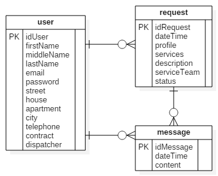
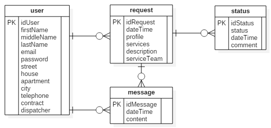
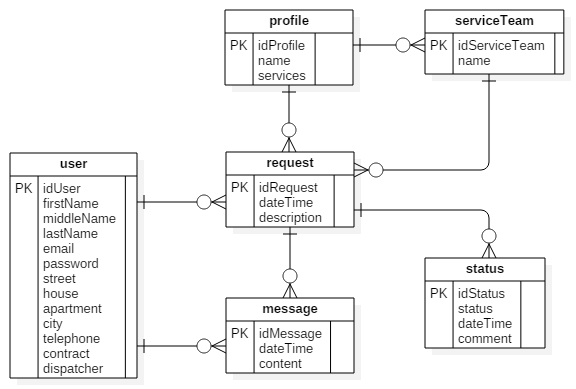
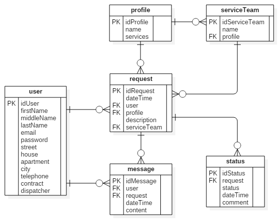
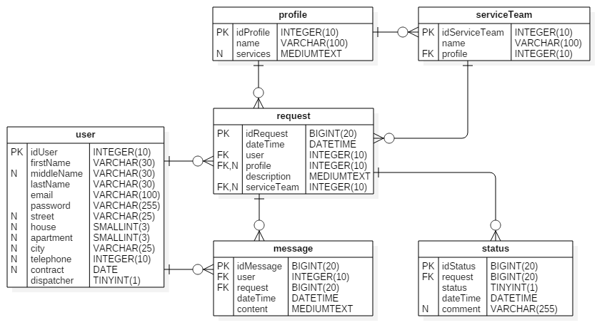

# 2 Розробка бази даних

## 2.1 Опис моделі даних

Використовуючи модель варіантів використання, яка була розроблена в розділі 1, опишемо модель даних у вигляді діаграми **сутностей і зв'язків**. Для цього виявляємо в описах варіантів використання веб-сайту об'єкти даних та їх властивості. Такі об'єкти на діаграмі сутностей і зв'язків є **сутностями** — реальними або уявними об'єктами, інформація про які має бути зібрана чи збережена [1]. Відповідно, певні властивості об'єктів представляються **атрибутами**. Атрибут — це деталь або аспект якісного чи кількісного опису сутностей, їхньої ідентифікації, класифікації або відображення їхнього стану [1]. Також на діаграмі відображаємо **зв'язки** — пойменовані асоціації двох або  більшої кількості сутностей [1].

Діаграма сутностей і зв'язків веб-сайту обслуговуючої комунальної компанії представлена на рис. 2.1.

<br/>



*Рисунок 2.1 - Діаграма сутностей і зв'язків веб-сайту обслуговуючої комунальної компанії*

<br/>

Модель "сутність-зв'язок" (рис. 2.1) містить три основні сутності виявлені в описах варіантів використання веб-сайту: `user` - користувач веб-сайту, `request` - заявка на обслуговування та `message` - повідовлення переписки між клієнтом та диспетчером щодо заявки. Користувачами є як клієнт, так і диспетчер компанії. Розрізняють їх в базі даних за атрибутом `dispatcher`, який для диспетчера буде мати значення `1`, а для клієнта, відповідно, - `0`.

Для визначення обмежень цілісності реляційних відношень обрані первинні ключі. На діаграмі сутностей і зв'язків (рис. 2.1) вони позначені як `PK`.

Для повноти розуміння предметної області також приведемо **приклади данних в реляційних відношеннях**. Приклад наведено в табл. 2.1 - 2.3.

<br/>

*Таблиця 2.1 - Реляційне відношення "user"*

idUser | firstName | middleName | lastName | email | password | street | house | apartment | city | telephone | contract | dispatcher
-------|-----------|------------|----------|-------|---------|--------|-------|-----------|------|-----------|----------|-----------
1 | Петро | Сергійович | Коваленко | petro.k@email.ua | 12345 | вул. Дорошенка | 16 | 24 | Мелітополь | 0975554433 | №29 від 15.04.2016 | 0
2 | Ірина | Олексіївна | Супрун | s.ira@email.ua | 98745 | вул. Дорошенка | 16 | 36 | Мелітополь | 0976677788 | №45 від 24.05.2016 | 0
3 | Олена | Віталіївна | Горбань | gorban@email.ua | 3698741 | - | - | - | - | 0976677788 | - | 1

<br/>

*Таблиця 2.2 - Реляційне відношення "request"*

idRequest | dateTime | user | profile | service | description | serviceTeam | status
----------|----------|------|---------|---------|------------|-------------|-------
145 | 2016-09-04 14:25 | Супрун І.О. | сантехніка | - Монтаж водопроводу<br/>- Заміна арматури<br/>- Чистка каналізації | Прочистити каналізацію | Панасенко, Мірошниченко | 2016-09-04 14:25 - 1<br>2016-09-04 16:40 - 3<br>2016-09-07 13:15 - 4
146 | 2016-09-04 15:05 | Коваленко П.С. | електрика | - Усунення аварійних відключень<br/>- Монтаж електропроводки | Немає електрики в квартирі | Пашко, Коваль | 2016-09-04 15:05 - 1<br>2016-09-04 17:25 - 2

<br/>

*Таблиця 2.3 - Реляційне відношення "message"*

idMessage | dateTime | user | request | content
----------|----------|------|---------|--------
1763 | 2016-09-04 15:05 | Горбань О.В. | 146 | Заявку створено (автоматичне повідомлення)
1764 | 2016-09-04 16:50 | Коваленко П.С. | 146 | Відмініть заяаку, будь ласка.

<br/>

## 2.2 Нормалізація відношень

### Перша нормальна форма

Реляційне відношення перебуває в **першій нормальній формі (1НФ)**, якщо всі йоги атрибути мають атомарні (прості) домени, відтак значення елементів таблиці є простими [1].

Перша нормальна форма (1НФ) утворює ґрунт для структурованої схеми бази даних [12]:
* Кожна таблиця повинна мати основний ключ: мінімальний набір колонок, які ідентифікують запис.
* Уникнення повторень груп (категорії даних, що можуть зустрічатись різну кількість разів в різних записах) правильно визначаючи неключові атрибути.
* Атомарність: кожен атрибут повинен мати лише одне значення, а не множину значень.

Перевірка реляційних відношень показала, що у відношенні `request` наявна невідновідність вимогам 1НФ - атрибут `status` містить неатомарні значення. З таблиці 2.2 видно що за цим атрибутом перелічуються всі статуси відповідної заявки.

Для зведення реляційних відношень до 1НФ виділимо атрибут `status` в окреме відношення `status` і зв'яжимо його з відношенням `request`. Слід також вімітити, що аналіз прикладу даних атрибуту `status` (табл. 2.2) демонструє моєжливість виділити в новому відношенні додаткові атрибути - дата та час зміни статусу, коментар до зміни статусу. Результат зведення до 1НФ приведено на рис. 2.2.

<br/>



*Рисунок 2.2 - Діаграма сутностей і зв'язків після приведення до 1НФ*

<br/>

Після виконаного зведення всі відношення знаходяться в 1НФ.

### Друга нормальна форма

Реляційне відношення перебуває в **другій нормальній формі** (2НФ), якщо воно перебуває в першій нормальній формі й усі його непервинні атрибути фунщіонально повно залежать від певного можливого ключа [1].

Друга нормальна форма (2НФ) вимагає, аби дані, що зберігаються в таблицях із композитним ключем не залежали лише від частини ключа [12]:
* Схема бази даних повинна відповідати вимогам першої нормальної форми.
* Дані, що повторно з'являються в декількох рядках виносяться в окремі таблиці.

Перевірка реляційних відношень показала, що в нашій моделі (рис. 2.2) відсутні композитні ключі, і, відповідно, всі відношення знаходяться в 2НФ.

### Третя нормальна форма

Реляційне відношення перебуває в **третій нормальній формі** (ЗНФ), якщо воно перебуває в другій нормальній формі й не містить транзитивних функціональних залежностей непервинних атрибутів від можливих ключів [1].

Третя нормальна форма (3НФ) вимагає, аби дані в таблиці залежали винятково від основного ключа [12]:
* Схема бази даних повинна відповідати всім вимогам другої нормальної форми.
* Будь-яке поле, що залежить від основного ключа та від будь-якого іншого поля, має виноситись в окрему таблицю.

Перевірка реляційних відношень показала, що в моделі (рис. 2.2) транзитивна функціональна залежність атрибуту `services` від первинного ключа через атрибут `profile`.

Для зведення реляційних відношень до 3НФ виділимо атрибути `profile` та `services` у нове відношення. Також варто винести атрибут `serviceTeam` до окремого відношення та зв'язати виділені відношення між собою. Результат зведення до 1НФ приведено на рис. 2.3.

<br/>



*Рисунок 2.3 - Діаграма сутностей і зв'язків після приведення до 3НФ*

<br/>

Після виконаного зведення всі відношення знаходяться в 3НФ.

### Нормальна форма Бойса-Кодда

Реляційне відношення перебуває в **нормальній формі Бойса-Кодда** (НФБК), коли воно має таку властивість: якщо довільний атрибут відношення, що не належить набору атрибутів А, залежить функціонально від А, то й усі атрибути відношення функціонально залежать від А [1].

Відношення знаходиться в НФБК, тоді і лише тоді коли детермінант кожної функціональної залежності є потенційним ключем. Якщо це правило не виконується, тоді щоб привести вказане відношення до НФБК його слід розділити на два відношення шляхом двох операцій проекції на кожну функціональну залежність детермінант, якої не є потенційним ключем [12].
* Проекція без атрибутів залежної частини такої функціональної залежності;
* Проекція на всі атрибути цієї функціональної залежності.

Перевірка реляційних відношень показала, що всі відношення знаходяться в НФБК.

### Четверта нормальна форма

Реляційне відношення `R` перебуває в **четвертій нормальній формі** — 4НФ, якщо з існування в ньому нетривіальної багатозначної залежності `X ->-> В`  випливає, що `X` є суперключем `R` [1].

Четверта нормальна форма (4НФ) вимагає, аби в схемі баз даних не було нетривіальних багатозначних залежностей множин атрибутів від будь чого, окрім надмножини ключа-кандидата. Вважається, що таблиця знаходиться у 4НФ тоді, і тільки тоді, коли вона знаходиться в НФБК, та багатозначні залежності є функціональними залежностями. Четверта нормальна форма усуває небажані структури даних - багатозначні залежності [12].

Перевірка реляційних відношень показала, що всі відношення знаходяться в 4НФ.

### П'ята нормальна форма

Реляційне відношення `R` перебуває в **п'ятій нормальній формі** (5НФ) тоді й тільки тоді, коли в кожній його нетривіальній залежності за з'єднанням ``\*(M<sub>1</sub>, M<sub>2</sub>,..., М<sub>n</sub>)`` будь-яка множина `М`, є можливим ключем `R`.

П'ята нормальна форма (5НФ) вимагає, аби не було не тривіальних залежностей об'єднання, котрі б не витікали із обмежень ключів. Вважається, що таблиця в п'ятій нормальній формі, тоді, і тільки тоді, коли вона знаходиться в 4НФ, та кожна залежність об'єднання зумовлена її ключами-кандидатами [12].

Перевірка реляційних відношень показала, що всі відношення знаходяться в 5НФ.

## 2.3 Визначення типів даних

Нормалізовані реляційні відношення представлені на рис. 2.3 не містять атрибутів, які є **зовнішніми ключами**, тобто реалізують зв'язки між відношеннями. Додамо ці атрибути до діаграми (рис. 2.4). Зовнішні ключі позначаємо як `FK`.

<br/>



*Рисунок 2.4 - Діаграма сутностей і зв'язків з зовнішніми ключами*

<br/>

Для атрибутів реляційних відношень визначаємо:

* зазначення типів даних та їхніх розмірів (обов'язкова властивість);
* чи є обов'язковим значення атрибута;
* чи може значення атрибута дублюватися;
* можливі значення за замовчуванням.

Результати заносимо в табл. 2.4 - 2.9.

<br/>

*Таблиця 2.4 - Типи даних реляційного відношення "user"*

Атрибут | Тип даних | Розмір | Додаткові обмеженні цілісності
--------|-----------|--------|-------------------------------
idUser | INT | 10 | первинний ключ
firstName  | VARCHAR | 30 | обов'язковий
middleName  | VARCHAR | 30 | -
lastName | VARCHAR | 30 | обов'язковий
email | VARCHAR | 100 |обов'язковий, унікальний
password | VARCHAR | 255 | обов'язковий
street | VARCHAR | 25 | -
house | SMALLINT | 3 |-
apartment | SMALLINT | 3 |-
city | VARCHAR | 25 |-
telephone | INT | 10 |-
contract | DATE | - | -
dispatcher | TINYINT | 1 | обов'язковий, за замовчуванням - 0

<br/>

*Таблиця 2.5 - Типи даних реляційного відношення "request"*

Атрибут | Тип даних | Розмір | Додаткові обмеженні цілісності
--------|-----------|--------|-------------------------------
idRequest | BIGINT | 20 | первинний ключ
dateTime  | DATETIME | - | обов'язковий
user | INT | 10 | зовнішній ключ, обов'язковий
profile | INT | 10 | зовнішній ключ
description | MEDIUMTEXT | - | обов'язковий
serviceTeam | INT | 10 | зовнішній ключ

<br/>

*Таблиця 2.6 - Типи даних реляційного відношення "status"*

Атрибут | Тип даних | Розмір | Додаткові обмеженні цілісності
--------|-----------|--------|-------------------------------
idStatus | BIGINT | 20 | первинний ключ
request | BIGINT | 20 | зовнішній ключ, обов'язковий
status | TINYINT | 1 | обов'язковий, за замовчуванням - 1
dateTime | DATETIME | - |обов'язковий
comment | VARCHAR(255) | - | -

<br/>

*Таблиця 2.7 - Типи даних реляційного відношення "profile"*

Атрибут | Тип даних | Розмір | Додаткові обмеженні цілісності
--------|-----------|--------|-------------------------------
idProfile | INT | 10 | первинний ключ
name | VARCHAR | 100 | обов'язковий
services | MEDIUMTEXT | - | -

<br/>

*Таблиця 2.8 - Типи даних реляційного відношення "serviceTeam"*

Атрибут | Тип даних | Розмір | Додаткові обмеженні цілісності
--------|-----------|--------|-------------------------------
idServiceTeam | INT | 10 | первинний ключ
name | VARCHAR | 100 | обов'язковий
profile | INT | 10 | зовнішній ключ, обов'язковий

<br/>

*Таблиця 2.9 - Типи даних реляційного відношення "message"*

Атрибут | Тип даних | Розмір | Додаткові обмеженні цілісності
--------|-----------|--------|-------------------------------
idMessage | BIGINT | 20 | первинний ключ
user | INT | 10 | зовнішній ключ, обов'язковий
request | BIGINT | 20 | зовнішній ключ, обов'язковий
dateTime | DATETIME | - | обов'язковий
content | MEDIUMTEXT | - | обов'язковий

Діаграма сутностей і зв'язків з позначенням типів та розмірів даних прийме наступний вигляд (рис. 2.5).

<br/>



*Рисунок 2.5 - Діаграма сутностей і зв'язків з позначенням типів та розмірів даних*

<br/>

На основі отриманої моделі сутностей і зв'язків з позначенням типів та розмірів даних складемо SQL- скрипт, який створює описану стурктуру бази даних.

*Лістинг 2.1 - Створення структури бази даних*
```
CREATE SCHEMA IF NOT EXISTS `utilities` DEFAULT CHARACTER SET utf8 COLLATE utf8_unicode_ci ;
USE `utilities` ;

CREATE TABLE IF NOT EXISTS `utilities`.`user` (
  `idUser` INT UNSIGNED NOT NULL,
  `firstName` VARCHAR(30) NOT NULL,
  `middleName` VARCHAR(30) NULL,
  `lastName` VARCHAR(30) NOT NULL,
  `email` VARCHAR(100) NOT NULL,
  `password` VARCHAR(255) NOT NULL,
  `street` VARCHAR(25) NULL,
  `house` SMALLINT(3) NULL,
  `apartment` SMALLINT(3) NULL,
  `city` VARCHAR(25) NULL,
  `telephone` INT(10) NULL,
  `contract` DATE NULL,
  `dispatcher` TINYINT(1) NOT NULL,
  PRIMARY KEY (`idUser`))
ENGINE = InnoDB;

CREATE TABLE IF NOT EXISTS `utilities`.`profile` (
  `idProfile` INT UNSIGNED NOT NULL,
  `name` VARCHAR(100) NOT NULL,
  `services` MEDIUMTEXT NULL,
  PRIMARY KEY (`idProfile`))
ENGINE = InnoDB;

CREATE TABLE IF NOT EXISTS `utilities`.`serviceTeam` (
  `idServiceTeam` INT UNSIGNED NOT NULL,
  `name` VARCHAR(100) NOT NULL,
  `profile` INT NOT NULL,
  PRIMARY KEY (`idServiceTeam`))
ENGINE = InnoDB;

CREATE TABLE IF NOT EXISTS `utilities`.`request` (
  `idRequest` BIGINT(20) UNSIGNED NOT NULL,
  `dateTime` DATETIME NOT NULL,
  `user` INT UNSIGNED NOT NULL,
  `profile` INT UNSIGNED NULL,
  `description` MEDIUMTEXT NOT NULL,
  `serviceTeam` INT UNSIGNED NULL,
  PRIMARY KEY (`idRequest`))
ENGINE = InnoDB;

CREATE TABLE IF NOT EXISTS `utilities`.`status` (
  `idStatus` BIGINT(20) UNSIGNED NOT NULL,
  `request` BIGINT(20) UNSIGNED NOT NULL,
  `status` TINYINT(1) NOT NULL,
  `dateTime` DATETIME NOT NULL,
  `comment` VARCHAR(255) NULL,
  PRIMARY KEY (`idStatus`))
ENGINE = InnoDB;

CREATE TABLE IF NOT EXISTS `utilities`.`message` (
  `idMessage` INT UNSIGNED NOT NULL,
  `user` INT UNSIGNED NOT NULL,
  `request` BIGINT(20) UNSIGNED NOT NULL,
  `dateTime` DATETIME NOT NULL,
  `content` MEDIUMTEXT NOT NULL,
  PRIMARY KEY (`idMessage`))
ENGINE = InnoDB;
```

## 2.4 Обмеження цілісності даних

В проекті вже були визначені деякі декларативні обмеження цілісності — тобто обмеження, що фіксують умови, яким має відповідати база даних [1]. Завдання СКБД - не допускати порушення цих умов. Зазвичай декларативні обмеження цілісності визначаються мовою опису структури даних.

У реляційних базах даних до об'єктів, на які поширюються обмеження цілісності, належать такі:

**Цілісність відношень**

У реляційній СКБД цілісність відношень визначається за допомогою первинного ключа, для якого мають виконуватися такі обмеження цілісності [1]:

* атрибути первинного ключа не можуть містити NULL-значень;
* значення первинного ключа (як окремого атрибута або сукупності атрибутів) не можуть дублюватися в межах відношення.

Первинні ключі всіх відношень були визначені раніше та приведені в табл. 2.4 - 2.9.

**Цілісність атрибутів**

У реляційній СКБД цілісність атрибутів може забезпечуватися [1]:

* зазначенням типів даних та їхніх розмірів (обов'язкова властивість);
* визначенням, чи є обов'язковим значення атрибута (NULL/NOT NULL);
* визначенням, чи може значення атрибута дублюватися (UNIQUE);
* зміною значення атрибута після його введення;
* встановленням умов, яким мають відповідати значення атрибута.

Типи, розмір та додаткові обмеженні цілісності атрибутів також були визначені в табл. 2.4 - 2.9.

**Цілісність зв'язків між відношеннями**

Цілісність зв'язків між відношеннями визначається зовнішніми ключами. Під час специфікації зовнішнього ключа вказуємо відповідний йому первинний ключ іншого відношення. Такий первинний ключ називається референцшним. Відношення, на яке здійснюється посилання за допомогою зовнішнього ключа, називається батьківським, а те, яке посилається, - дочірнім.

Після визначення зовнішніх ключів, у нас є захист цілісності даних на випадок будь-яких маніпуляцій з дочірніми таблицями. Але для того щоб бути впевненими, що  дочірні таблиці в курсі всіх змін в батьківській таблиці треба додатково визначити поведінку СКБД під час оновлення або видалення даних в батьківській таблиці.

Всі зовнішні ключі з відповідними обмеженнями цілісності зв'язків між відношеннями приводимо в талб. 2.10.

*Таблиця 2.10 - Обмеження цілісності зв'язків між відношеннями*

Дочірня таблиця<br/>таблиця(атрибут) | Батьківська таблиця<br/>таблиця(атрибут) | Поведінка при оновленні | Поведінка при видаленні
-------------------------------------|------------------------------------------|-------------------------|---------------------------
request(user) | user(idUser) | CASCADE | RESTRICT
request(profile) | profile(idProfile) | CASCADE | RESTRICT
request(serviceTeam) | serviceTeam(idServiceTeam) | CASCADE | RESTRICT
serviceTeam(profile) | profile(idProfile) | CASCADE | RESTRICT
message(user) | user(idUser) | CASCADE | CASCADE
message(request) | request(idRequest) | CASCADE | CASCADE
status(request) | request(idRequest) | CASCADE | CASCADE

Реалізація зазначених обмежень цілісності даних також потребуватиме визначення індексів за атрибутами, які є зовнішніми ключами. Реалізація обмеженнь цілісності зв'язків між відношеннями приведена в лістингу 2.2.

*Лістинг 2.2 - Обмеження цілісності зв'язків між відношеннями*
```
ALTER TABLE `utilities`.`serviceTeam`
  ADD CONSTRAINT `fk_serviceTeam_profile1`
    FOREIGN KEY (`profile`)
    REFERENCES `utilities`.`profile` (`idProfile`)
    ON DELETE RESTRICT
    ON UPDATE CASCADE;
CREATE INDEX `fk_serviceTeam_profile1_idx` ON `utilities`.`serviceTeam` (`profile` ASC);

ALTER TABLE `utilities`.`request`
  ADD CONSTRAINT `fk_request_user`
    FOREIGN KEY (`user`)
    REFERENCES `utilities`.`user` (`idUser`)
    ON DELETE RESTRICT
    ON UPDATE CASCADE,
  ADD CONSTRAINT `fk_request_profile1`
    FOREIGN KEY (`profile`)
    REFERENCES `utilities`.`profile` (`idProfile`)
    ON DELETE RESTRICT
    ON UPDATE CASCADE,
  ADD CONSTRAINT `fk_request_serviceTeam1`
    FOREIGN KEY (`serviceTeam`)
    REFERENCES `utilities`.`serviceTeam` (`idServiceTeam`)
    ON DELETE RESTRICT
    ON UPDATE CASCADE;
CREATE INDEX `fk_request_user_idx` ON `utilities`.`request` (`user` ASC);
CREATE INDEX `fk_request_profile1_idx` ON `utilities`.`request` (`profile` ASC);
CREATE INDEX `fk_request_serviceTeam1_idx` ON `utilities`.`request` (`serviceTeam` ASC);

ALTER TABLE `utilities`.`status`
  ADD CONSTRAINT `fk_status_request1`
    FOREIGN KEY (`request`)
    REFERENCES `utilities`.`request` (`idRequest`)
    ON DELETE CASCADE
    ON UPDATE CASCADE;
CREATE INDEX `fk_status_request1_idx` ON `utilities`.`status` (`request` ASC);

ALTER TABLE `utilities`.`message`
  ADD CONSTRAINT `fk_message_user1`
    FOREIGN KEY (`user`)
    REFERENCES `utilities`.`user` (`idUser`)
    ON DELETE CASCADE
    ON UPDATE CASCADE,
  ADD CONSTRAINT `fk_message_request1`
    FOREIGN KEY (`request`)
    REFERENCES `utilities`.`request` (`idRequest`)
    ON DELETE CASCADE
    ON UPDATE CASCADE;
CREATE INDEX `fk_message_user1_idx` ON `utilities`.`message` (`user` ASC);
CREATE INDEX `fk_message_request1_idx` ON `utilities`.`message` (`request` ASC);
```

## 2.5 Індекси

Індекси дозволяють значно підвищити швидкість доступу до записів за індексованими атрибутами та забезпечує ефективну перевірку унікальності значень індексованих полів [1].

Унікальні атрибути вже були визначені в табл. 2.4 - 2.9.

Індекси з метою прискорення пошуку інформації визначаємо шляхом аналізу варіантів використання нашого веб-сайту. З основних сценаріїв дії користувачів видно, що найбільш типовими ситуаціями пошуку у великому обсязі даних є пошук за прізвищем клієнта в таблиці `user` та пошук за змістом заявки на обслуговування в таблиці `request`. Для цих двох випадків визначимо індекси (табл. 2.11).

*Таблиця 2.11 - Індекси*

Таблиця | Атрибут | Порядок сортування
--------|---------|-------------------
user | lastName | за зростанням
request | description | за зростанням

*Лістинг 2.3 - Індекси*
```
CREATE INDEX `user_idx` USING BTREE ON `utilities`.`user` (`lastName` ASC);

CREATE INDEX `description_idx` USING BTREE ON `utilities`.`request` (`description` ASC);
```

## 2.6 Тригери

Тригери реалізують динамічні обмеження цілісності - тобто обмеження, які встановлюють залежність між різними частинами бази даних у різні моменти часу.

Відповідно до специфікації варіантів використання системи (табл. 1.1-1.9) в двох ситуаціях необхідне визначення тригерів:

1. При подачі заявки Клієнтом Система автоматично присвоює заявці статус 1 - "Очікує розгляду".
2. При призначенні Диспетчером бриагади на виконання заявки система автоматично присвоює заявці статус 3 - "Призначено бригаду".

*Лістинг 2.4 - Тригери*
```
CREATE TRIGGER `utilities`.`request_AFTER_INSERT`
	AFTER INSERT ON `request`
  FOR EACH ROW
BEGIN
	INSERT INTO `status` SET request = NEW.id, status = 1,
  dateTime = NOW();
END;

CREATE TRIGGER `utilities`.`request_AFTER_UPDATE`
	AFTER UPDATE ON `request`
  FOR EACH ROW
BEGIN
	IF NEW.serviceTeam <> NULL THEN  
		INSERT INTO `status` SET request = NEW.id, status = 3,
		dateTime = NOW();
	END IF;
END;
```

## 2.7 Реалізація SQL-скрипту

Остаточний варіант SQL-скрипту, який реалізує структуру бази даних, приведено в [додатку А](apendix-a.md).
